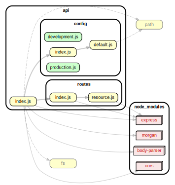

<!-- BEGIN title -->

# API

<!-- END title -->

<!-- BEGIN TREE -->

<!-- END TREE -->

<!-- BEGIN TOC -->

- business-logic
- config
  - [default.js](#apiconfigdefaultjs)
  - [development.js](#apiconfigdevelopmentjs)
  - [index.js](#apiconfigindexjs)
  - [production.js](#apiconfigproductionjs)
- controllers
- data-access
- middleware
- routes
  - [index.js](#apiroutesindexjs)
  - [resource.js](#apiroutesresourcejs)
- utils
- [index.js](#apiindexjs)

---

<!-- END TOC -->

---

<!-- BEGIN DOCS -->

# /business-logic

---

# /config

<a href="../../api/config/default.js" id="apiconfigdefaultjs">../api/config/default.js</a>

<a href="../../api/config/development.js" id="apiconfigdevelopmentjs">../api/config/development.js</a>

<a href="../../api/config/index.js" id="apiconfigindexjs">../api/config/index.js</a>

<a href="../../api/config/production.js" id="apiconfigproductionjs">../api/config/production.js</a>

---

# /controllers

---

# /data-access

---

# /middleware

---

# /routes

<a href="../../api/routes/index.js" id="apiroutesindexjs">../api/routes/index.js</a>

<a href="../../api/routes/resource.js" id="apiroutesresourcejs">../api/routes/resource.js</a>

---

# /utils

---

<a href="../../api/index.js" id="apiindexjs">../api/index.js</a>

<!-- END DOCS -->
